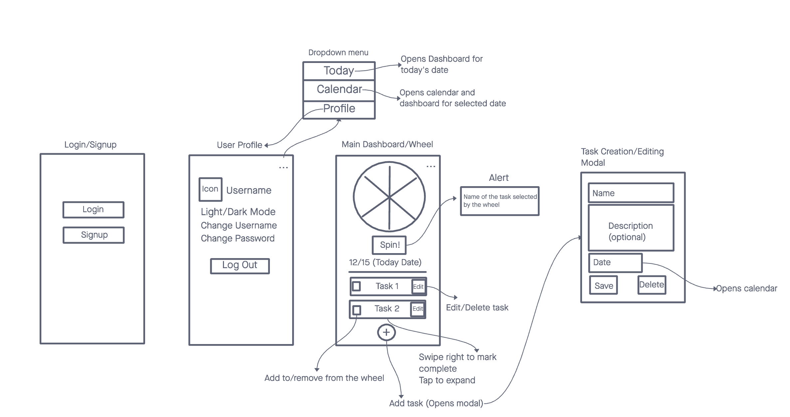

# ToDoSpinner

ToDoSpinner is a React Native mobile application that introduces a fun and interactive way to manage daily tasks. With a unique 'wheel of fortune' feature, users can let chance decide which task to tackle next.

**Note:** This project is still under development.

## QR Code for iOS

**Scan the QR code with your iOS device to test the app.**

## Features

- **User Authentication**: Secure login and signup functionality to keep your tasks private.
- **User Profile**: Customizable user profiles.
- **Task Management**: Add, edit, and delete tasks with ease.
- **Wheel of Fortune**: Spin the wheel to randomly select a task for an engaging productivity experience.
- **Calendar Integration**: View tasks in a calendar layout and manage deadlines.
- **Task Editing Modal**: A dedicated modal for updating task details.

## User Stories

- **As a user, I want to sign up for a new account so that I can keep my tasks private and secure.**
- **As a user, I want to log in and out of my account so that I can access my task list from any device.**
- **As a user, I want to add, edit, and delete tasks to manage my daily responsibilities.**
- **As a user, I want to spin the 'wheel of fortune' to randomly select a task for me, adding an element of fun to my daily routine.**

## Wireframe

## Contributors

- Ekaterina Khoroshilova

## Icon Attribution

- Settings Icon: "Settings icons created by srip - Flaticon" [Link](https://www.flaticon.com/free-icons/settings)
- Trash Icon: "Trash icons created by Artist - Flaticon" [Link](https://www.flaticon.com/free-icons/trash1)
- Wheel of Fortune Icon: "Wheel of fortune icons created by Freepik - Flaticon" [Link](https://www.flaticon.com/free-icons/wheel-of-fortune)
