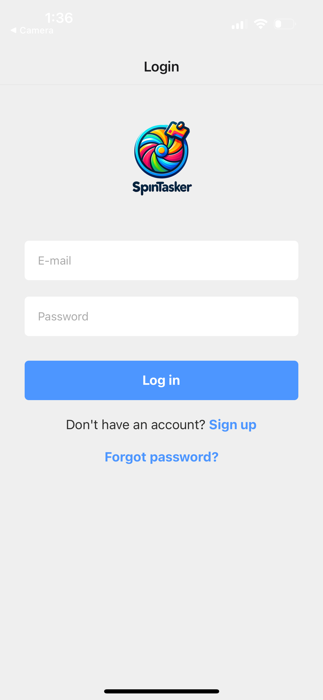
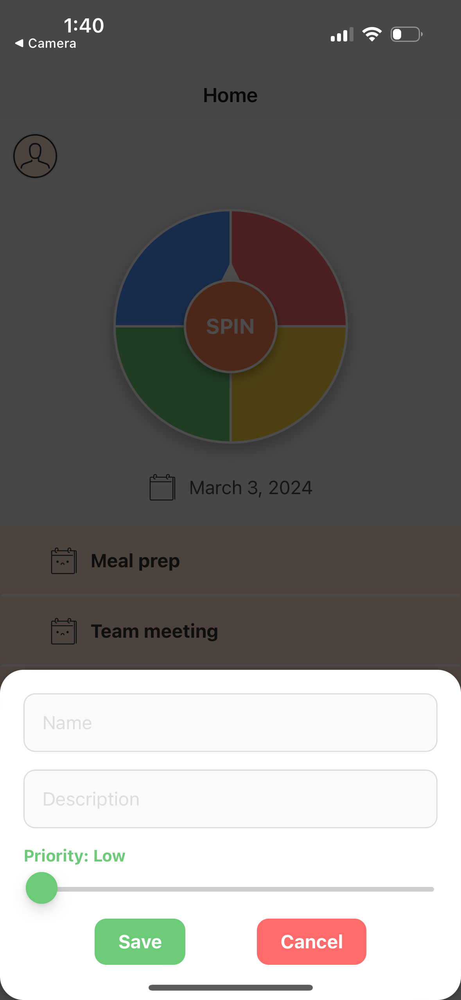
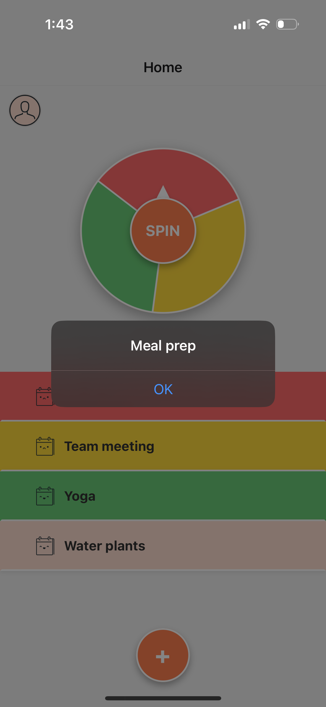
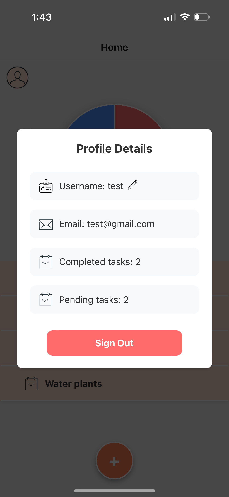

# SpinTasker

SpinTasker is a React Native mobile application that introduces a fun and interactive way to manage daily tasks. With a unique 'wheel of fortune' feature, users can let chance decide which task to tackle next.

**Note:** This project is still under development.

**Demo Account:** To experience SpinTasker without signing up, use the following test account:
- **Email**: test@gmail.com
- **Password**: test123

## QR Code for iOS

**Scan the QR code with your iOS device to test the app.**

## Login Screen

*The login screen for SpinTasker where users can sign in or register.*

## Main Interface

*The main interface of SpinTasker featuring the 'wheel of fortune' and task list with slide-to-edit and delete functionality.*

## Task Management

*Adding and managing tasks is streamlined with an easy-to-use interface.*

## Task Selection

*The 'wheel of fortune' feature in action, selecting a random task.*

## Profile Details

*Users can view and manage their profile details, including task completion statistics.*

## Features

- **User Authentication**: Secure login and signup functionality to keep tasks private.
- **User Profile**: Customizable profiles, including options to update usernames and view task statistics such as the number of completed and pending tasks.
- **Task Management**: Add, edit, and delete tasks with ease. Tasks can be prioritized for better organization.
- **Wheel of Fortune**: Spin the wheel to randomly select a task for an engaging and novel productivity experience.
- **Calendar Integration**: Interactive calendar to select dates, add new tasks, view, edit, and delete existing tasks for any selected date, helping users manage deadlines effectively.
- **Task Editing Modal**: A dedicated modal for updating task details.
- **Swipe-to-Edit/Delete**: Easy task management with swipe gestures.

## User Stories

- **As a user, I want to sign up for a new account to keep my tasks private and secure.**
- **As a user, I want to log in and out of my account to access my task list from any device.**
- **As a user, I want to add, edit, and delete tasks to manage my daily responsibilities.**
- **As a user, I want to interact with a calendar to manage my tasks based on specific dates.**
- **As a user, I want to spin the 'wheel of fortune' to randomly select a task for me, adding an element of fun to my routine.**
- **As a user, I want to update my profile details, including my username.**
- **As a user, I want to view my task statistics, such as completed and pending tasks, to track my productivity.**

## Wireframe

## Contributors

- Ekaterina Khoroshilova

## Icon Attribution

- Settings Icon: "Settings icons created by srip - Flaticon" [Link](https://www.flaticon.com/free-icons/settings)
- Trash Icon: "Trash icons created by Artist - Flaticon" [Link](https://www.flaticon.com/free-icons/trash1)
- Wheel of Fortune Icon: "Wheel of fortune icons created by Freepik - Flaticon" [Link](https://www.flaticon.com/free-icons/wheel-of-fortune)
